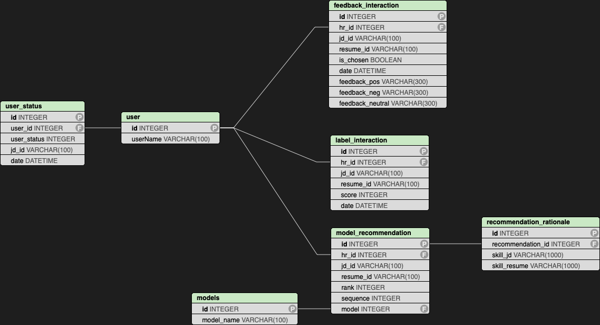

# ResumeRecommendation_datasets
This repository contains the human annotation dataset collected using the Feedback-Enhanced Resume Recommender (FERR) model.

Please refer to `table_relation.png` to understand the relationships among these tables. For anonymity reasons, the `user` table and `user_status` table have been removed. Additionally, the `date` column in the interaction tables has been removed. This removal will not affect the table content as these tables and columns are used internally to ensure system consistency.

**Table Relation**

